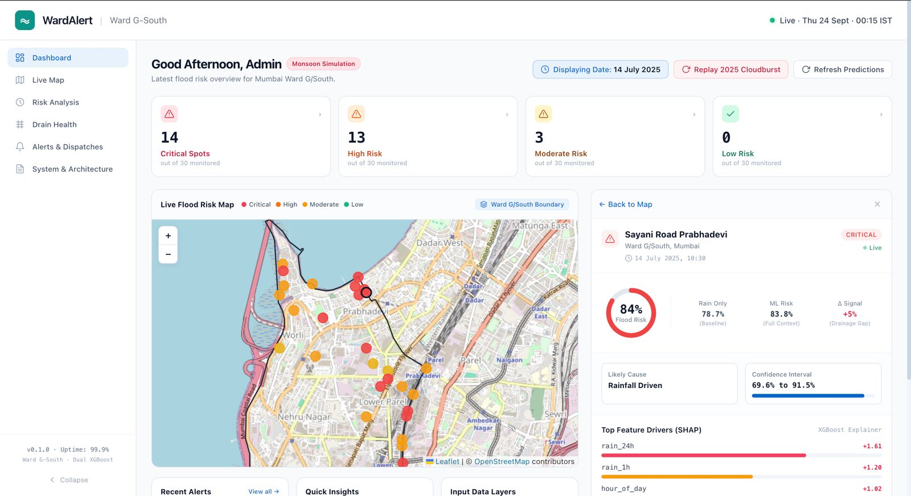

# WardAlert

**Hyperlocal flood prediction and civic dispatch for Mumbai Ward G/South.**

WardAlert predicts waterlogging at 30 chronic flood spots in Ward G/South (Worli, Lower Parel, Prabhadevi, Mahalaxmi and Currey Road). For each spot it also says *why* the spot is flooding: whether the rain is simply too heavy, or whether a failing drain is making things worse. That answer sets who gets sent. Heavy rain calls for pumps and traffic marshals. A failing drain calls for a desilting crew.

It is built on real public data:

- 30 flood spots identified by the Brihanmumbai Municipal Corporation (BMC)
- 54 OpenStreetMap stormwater drainage segments
- 1,096 days of CHIRPS/ERA5 rainfall (2023–2025)
- 32 documented flood events
- NASA SRTM elevation data

Built for **MUSA CodeX 2026**.



---

## Table of contents

1. [Live deployment](#live-deployment)
2. [The core idea: the dual-model residual](#the-core-idea-the-dual-model-residual)
3. [Features](#features)
4. [Tech stack](#tech-stack)
5. [Architecture](#architecture)
6. [Repository layout](#repository-layout)
7. [Getting started](#getting-started)
8. [Configuration](#configuration)
9. [API reference](#api-reference)
10. [WhatsApp citizen bot](#whatsapp-citizen-bot)
11. [Database schema](#database-schema)
12. [Model performance](#model-performance)
13. [Deployment](#deployment)
14. [Testing and verification](#testing-and-verification)
15. [Data provenance and honest limitations](#data-provenance-and-honest-limitations)
16. [Known issues](#known-issues)
17. [Further documentation](#further-documentation)
18. [Data attribution](#data-attribution)

---

## Live deployment

| Service | Stack | URL |
| :--- | :--- | :--- |
| Frontend dashboard | Next.js 14 | https://wardalert-mumbai.onrender.com |
| Backend REST API | FastAPI · Python 3.11 | https://wardalert-backend.onrender.com |
| Interactive API docs | Swagger / OpenAPI | https://wardalert-backend.onrender.com/docs |
| Database | PostgreSQL 16 + PostGIS | Supabase (`ap-south-1`, Mumbai) |

> Both services run on Render's free tier. They sleep when idle, so the first request after a quiet period can take 30–60 seconds.

---

## The core idea: the dual-model residual

Rain alone does not explain why Mumbai floods unevenly. Two spots a kilometre apart can get the same cloudburst, and one floods because its drain is choked.

WardAlert trains **two XGBoost classifiers** on the same labelled events:

| Model | Features | Output |
| :--- | :--- | :--- |
| **Model A** (baseline) | `rain_1h`, `rain_3h`, `rain_24h`, `antecedent_moisture`, `elevation_m`, `depression_depth_m` | `P_rain`: flood risk explained by rain and terrain alone |
| **Model B** (full context) | Model A's features, plus `drain_distance_m`, `monsoon_week`, `hour_of_day`, `crowd_reports_500m_2h` | `P_actual`: flood risk given everything known |

The difference between them is the signal:

```
Δ = P_actual − P_rain
```

| Δ | Interpretation | `cause_label` | `dispatch_type` |
| :--- | :--- | :--- | :--- |
| `< CAUSE_DELTA_THRESHOLD` (0.15) | Rainfall is overwhelming normal capacity | `rainfall_driven` | `pump_and_traffic`: dewatering pumps and traffic marshals |
| `≥ CAUSE_DELTA_THRESHOLD` | Risk is higher than rainfall can explain, pointing to a blocked or silted drain | `drainage_failure` | `desilting_crew`: emergency desilting |

Model A is deliberately blind to drainage, so anything Model B adds can be attributed to drainage, timing and ground reports. `ml/train_model_b.py` **stops the run if Model B does not beat Model A**. A residual between two equally good models would be noise.

Tracked week by week, Δ also powers the **Drain Health Index**. A drain that is silting up shows Δ rising at its spot before anyone reports a blockage.

---

## Features

| Area | What it does |
| :--- | :--- |
| **Dual-model prediction** | `P_rain`, `P_actual` and Δ for any spot at any timestamp, with a risk tier (low / moderate / high / critical), a cause label and a dispatch recommendation |
| **Explainability** | The top 3 SHAP drivers of each Model B prediction, with the direction of each effect |
| **Uncertainty** | A Bayesian Beta-posterior credible interval (90% by default) around every probability |
| **Drain Health Index** | Weekly Δ aggregation, a linear trend fit, a 0–100 health score and a projected failure date for each spot, shown as a maintenance leaderboard |
| **Desilting log** | `POST /api/drain-health/{id}/desilt` records a desilting event and returns an 8-week recovery projection. Past observations are kept unchanged as an audit trail. |
| **Monsoon replay** | Replays a historical cloudburst (July 2025) or a random historical date across all 30 spots from the dashboard |
| **Crowd reports** | Citizen flood reports are matched with PostGIS to the nearest spot within 500 m, and feed Model B's `crowd_reports_500m_2h` feature |
| **WhatsApp alerts** | Alerts in 4 languages (English, Hindi, Hinglish, Marathi). A normal broadcast goes to a spot's subscribers. A critical broadcast goes to everyone within 2 km over WhatsApp and SMS. Every send is recorded in the `alerts_sent` audit log. |
| **WhatsApp citizen bot** | A Twilio webhook handles location-pin subscription and the `STATUS`, `EXTEND` and `STOP` commands, plus language switching. Phone numbers are stored only as SHA-256 hashes. |
| **Graceful degradation** | If the models fail to load, `/api/health` reports `degraded` and the database-backed endpoints keep serving |

### Dashboard pages

| Route | Page |
| :--- | :--- |
| `/` | **Dashboard**: ward map, KPI cards, risk panel with SHAP chart and confidence badge, dispatch card, and cloudburst replay controls |
| `/map` | **Live Map**: interactive OpenStreetMap view of all spots, filterable by risk |
| `/risk-analysis` | **Risk Analysis**: Model A vs Model B comparison and spot ranking |
| `/drain-health` | **Drain Health**: maintenance leaderboard, trend chart, failure badges and the desilting log |
| `/alerts` | **Alerts & Dispatches**: WhatsApp broadcast, subscriber counts, message preview and alert log |
| `/about` | **System & Architecture**: how the system works |
| `/privacy`, `/terms` | Privacy notice (DPDP Act 2023) and terms of use |

The whole UI follows one shared "display date" (`frontend/src/lib/displayDate.ts`). Every data hook reads the same historical moment, and you can set it through the `?at=<ISO timestamp>` query parameter.

---

## Tech stack

| Layer | Technology |
| :--- | :--- |
| Frontend | Next.js 14 (App Router), React 18, TypeScript, Tailwind CSS, React-Leaflet (OpenStreetMap tiles), Recharts, SWR, lucide-react |
| Backend | FastAPI 0.115, Uvicorn, Pydantic 2, async SQLAlchemy 2 + asyncpg |
| Database | PostgreSQL 16 + PostGIS 3.4 (Docker locally, Supabase in production) |
| ML | XGBoost 2.1, SHAP 0.46, scikit-learn, SciPy (Beta posterior), pandas, NumPy |
| Geospatial | GeoPandas, Shapely, Rasterio (SRTM `.hgt`), PostGIS (EPSG:4326 storage, EPSG:32643 UTM 43N for metric distances) |
| Messaging | Twilio (WhatsApp / SMS). Runs in simulated mode when no credentials are set. |
| Hosting | Render (API and frontend, via `render.yaml`), Supabase (Postgres) |

---

## Architecture

```
   data/  (real public data, committed)
     │
 ┌───▼──────────────────────────────────────────────────────────┐
 │ 1. INGEST        data_loader/                                │
 │    GeoJSON + CSV ──► PostGIS (idempotent upserts)            │
 │    Derives nearest_drain_m (PostGIS) and                     │
 │    depression_depth_m (SRTM), which the source data lacks    │
 └───┬──────────────────────────────────────────────────────────┘
     │  ward_boundary · flood_spots · drainage_segments · rainfall_daily · flood_events
 ┌───▼──────────────────────────────────────────────────────────┐
 │ 2. FEATURES      ml/feature_engineering.py                   │
 │    32 real positives + 160 sampled negatives = 192 rows      │
 │    Daily rain ──► hourly via a Gaussian diurnal curve        │
 └───┬──────────────────────────────────────────────────────────┘
     │  feature_snapshots
 ┌───▼──────────────────────────────────────────────────────────┐
 │ 3. DUAL MODEL    ml/train_model_a.py · ml/train_model_b.py   │
 │    A: rain + terrain            ──► P_rain    (AUC 0.819)    │
 │    B: A + drainage/time/crowd   ──► P_actual  (AUC 0.850)    │
 │    Δ = P_actual − P_rain                                     │
 └───┬──────────────────────────────────────────────────────────┘
     │
 ┌───▼──────────────────────────────────────────────────────────┐
 │ 4. DIAGNOSTICS   ml/learn_thresholds.py ──► thresholds.json  │
 │    AUCs, Youden's J, Δ distribution, critical_delta          │
 │    (operating cut-offs are fixed in config.py; see below)    │
 └───┬──────────────────────────────────────────────────────────┘
     │
 ┌───▼───────────────────────────┬──────────────────────────────┐
 │ 5a. SERVE   backend/          │ 5b. DRAIN HEALTH             │
 │     FastAPI + SHAP + Beta CI  │     drain_health/            │
 │     WhatsApp alerts & bot     │     weekly Δ ──► trend ──►   │
 │                               │     failure date             │
 └───────────────┬───────────────┴──────────────────────────────┘
                 │  REST (JSON)
 ┌───────────────▼──────────────────────────────────────────────┐
 │ 6. FRONTEND    frontend/  (Next.js dashboard)                │
 └──────────────────────────────────────────────────────────────┘
```

Key design points:

- **One inference path.** `ml/predict.py` (`Predictor`) serves the API and also generates the drain-health bootstrap history. A number on the dashboard and a number behind a failure-date forecast therefore come from the same code. The feature functions used in training are the same ones used at inference.
- **Models load once**, in the FastAPI lifespan. Both boosters, the SHAP `TreeExplainer` and the JSON configs are held in `app.state`. CPU-bound inference runs in a worker thread so it does not block the event loop.
- **Operating thresholds are fixed, not learned.** The risk tiers (`0.4 / 0.6 / 0.8` on `P_actual`) and the cause cut-off (`Δ ≥ 0.15`) are constants in `config.py`. The earlier learned quartiles were computed over mostly dry days, which put every spot in "critical" as soon as it rained. `ml/learn_thresholds.py` now writes only diagnostics.
- **Drain health maths:**
  ```
  predictions ──GROUP BY (spot, year, week)──► avg_delta, max_delta, count
              ──np.polyfit(weeks, avg_delta, 1)──► trend_slope, intercept
              ──solve slope·w + intercept = critical_delta──► failure date
  health_score = 100 × (1 − avg_delta / critical_delta), clipped to [0, 100]
  ```
  A spot whose Δ is flat or falling gets **no** failure date. A spot that has already crossed the critical level reports the date it crossed.

See [`docs/architecture.md`](docs/architecture.md) for the full per-layer write-up.

---

## Repository layout

```
WardAlert/
├── config.py                  # Single source of truth for every tunable value (reads .env)
├── .env.example               # Documented template for every environment variable
├── requirements.txt           # Python dependencies (pinned)
├── docker-compose.yml         # Local PostGIS 16-3.4 container; applies database/init.sql
├── render.yaml                # Render blueprint: backend + frontend web services
├── standalone_api.js          # Zero-dependency Node mock API (heuristic, no ML; see below)
├── whatsapp.md                # Detailed WhatsApp alert and citizen-bot specification
│
├── backend/                   # FastAPI application
│   ├── main.py                # App, lifespan model loading, CORS, router wiring
│   ├── db.py                  # Async engine/session (SSL auto-enabled for remote hosts)
│   ├── deps.py                # get_predictor dependency (503 if models absent)
│   ├── models/                # SQLAlchemy ORM models, one per table
│   ├── routers/               # health, spots, predict, drain_health, crowd_reports, alerts, whatsapp
│   ├── schemas/               # Pydantic request/response models
│   └── services/              # prediction, drain health, crowd matching, subscribers, WhatsApp
│
├── data_loader/               # Layer 1: ingest committed data into PostGIS
│   ├── main.py                # Runs every loader in dependency order (idempotent)
│   ├── load_*.py              # ward boundary, flood spots, drainage, rainfall, flood events
│   ├── compute_spatial_features.py  # nearest_drain_m and depression_depth_m
│   ├── fuzzy.py               # Event-to-spot name matching
│   └── seed_subscribers.py    # Seeds 5 demo WhatsApp subscribers per spot
│
├── ml/                        # Layers 2–4: features, training, inference
│   ├── feature_engineering.py # Builds feature_snapshots; shared with inference
│   ├── label_matching.py      # Verifies all flood events match a spot
│   ├── dataset.py             # Loads snapshots and performs the stratified split
│   ├── train_model_a.py       # Rain + terrain baseline (aborts below MIN_MODEL_A_AUC)
│   ├── train_model_b.py       # Full-context model (aborts if it fails to beat A)
│   ├── learn_thresholds.py    # Writes diagnostics to thresholds.json
│   ├── metrics.py             # AUC, AP, precision/recall/F1
│   ├── shap_explainer.py      # SHAP TreeExplainer, top-3 drivers
│   ├── confidence.py          # Beta-posterior credible interval
│   ├── predict.py             # Predictor: spot + timestamp → full decision payload
│   └── models/                # Committed artifacts: model_a/b.joblib, thresholds.json, feature_columns.json
│
├── drain_health/              # Layer 5b
│   ├── main.py                # Bootstraps 2023–25 monsoon predictions, then builds the index
│   ├── compute_weekly_delta.py
│   ├── fit_trend.py
│   └── predict_failure_date.py
│
├── database/
│   ├── init.sql               # PostGIS schema: 12 tables + v_latest_risk view
│   └── supabase_dump.sql      # Full schema + data dump for cloud restore
│
├── data/
│   ├── raw/                   # BMC_Wards.geojson, N19E072.hgt (SRTM tile)
│   └── processed/             # Ward G/South spots, drainage, rainfall, events, boundary
│
├── frontend/                  # Next.js 14 dashboard
│   ├── public/ward-g-south.geojson
│   └── src/
│       ├── app/               # Routes: /, /map, /risk-analysis, /drain-health, /alerts, /about, /privacy, /terms
│       ├── components/        # Dashboard, Map, DrainHealth, Alerts, Layout, Common
│       ├── hooks/             # useSpots, useSpot, usePredict, useDrainHealth, useAlertsLog, useSubscriberCount
│       └── lib/               # api.ts (typed client), types.ts, constants.ts, displayDate.ts, utils.ts
│
├── whatsapp_templates/        # alert_en.txt, alert_hi.txt, alert_hinglish.txt, alert_mr.txt
├── scripts/
│   ├── migrate_to_supabase.py # Pushes schema + data to a cloud Postgres
│   ├── capture_screenshots.py # Playwright screenshot capture
│   └── verify_ui.py           # Playwright UI check (desktop + mobile)
├── tests/test_subscribers.py  # WhatsApp subscriber / webhook regression suite
└── docs/                      # Architecture, API reference, data provenance, feature status, verification run
```

---

## Getting started

### Prerequisites

- **Python 3.11**
- **Node.js 18+** and npm
- **Docker** (for the local PostGIS database). Any PostgreSQL 16 server with PostGIS also works.

### Option 1: Full stack (recommended)

This runs the real pipeline: PostGIS, trained XGBoost models, SHAP explanations and drain health.

```bash
cd WardAlert

# 1. Python environment
python3.11 -m venv .venv
source .venv/bin/activate            # Windows: .venv\Scripts\activate
pip install -r requirements.txt

# 2. Configuration
cp .env.example .env                 # defaults work out of the box

# 3. Database (schema from database/init.sql is applied on first start)
docker compose up -d db

# 4. Load the committed public data into PostGIS
python -m data_loader.main
```

The trained models are **already committed** in `ml/models/`, so you can skip straight to step 6. To rebuild the models from scratch instead:

```bash
# 5. (Optional) Rebuild the ML pipeline
python -m ml.label_matching          # check all 32 events match a spot
python -m ml.feature_engineering     # build 192 feature_snapshots
python -m ml.train_model_a           # rain + terrain baseline
python -m ml.train_model_b           # full context; aborts if it doesn't beat A
python -m ml.learn_thresholds        # write diagnostics to thresholds.json
```

Then build the drain health history, seed demo subscribers and start the API:

```bash
# 6. Drain health: bootstraps ~4,650 historical predictions, then fits trends
python -m drain_health.main

# 7. (Optional) Seed demo WhatsApp subscribers (5 per spot)
python -m data_loader.seed_subscribers

# 8. Start the API
uvicorn backend.main:app --reload --port 8000
```

In a second terminal, start the frontend:

```bash
cd frontend
cp .env.local.example .env.local     # NEXT_PUBLIC_API_URL=http://localhost:8000
npm install
npm run dev
```

| URL | What |
| :--- | :--- |
| http://localhost:3000 | Dashboard |
| http://localhost:8000/docs | Swagger UI |
| http://localhost:8000/api/health | Health check |

**Quick smoke test**. This uses a real flood moment. Predictions for "now" fall after the rainfall record ends, so every rain feature is 0:

```bash
curl -X POST http://localhost:8000/api/predict \
  -H "Content-Type: application/json" \
  -d '{"spot_id": 1, "timestamp": "2025-07-15T10:30:00Z"}'
```

> **Port 5432 already in use?** Set `POSTGRES_PORT=5434` (or any free port) in `.env`. Docker Compose, the loaders and the API all read it.

### Option 2: Node mock API (UI work only)

`standalone_api.js` is a single-file Node server with no dependencies. It serves the same routes the frontend calls, so you can work on the UI without Python or Docker:

```bash
node standalone_api.js               # http://localhost:8000
cd frontend && npm install && npm run dev
```

> ⚠️ This mock does **not** run the trained models. It computes `P_rain` and `P_actual` with hand-written heuristic formulas, returns fixed SHAP values and a fixed-width confidence band, and stores its state in `data/wardalert_db.json`. Use it for frontend development only. Do not use it for demos of the model or for any numbers you report.

### Option 3: Restore into a cloud database (Supabase)

```bash
# Full schema + data from the committed dump
python scripts/migrate_to_supabase.py --url "postgresql://postgres:<password>@db.<ref>.supabase.co:5432/postgres" --use-dump

# Or: apply init.sql and run the data loader against the remote DB
python scripts/migrate_to_supabase.py --url "postgresql://..."
```

Then set `DATABASE_URL` in `.env` (or in the Render dashboard) and start the API. `postgres://` and `postgresql://` URLs are converted automatically for psycopg2 and asyncpg. SSL is turned on for any host that isn't local.

---

## Configuration

Every tunable value is read in [`config.py`](config.py) from the environment (or from `.env`). Nothing else in the code hardcodes a threshold, path or credential. [`.env.example`](.env.example) documents every variable. The most important ones:

| Variable | Default | Purpose |
| :--- | :--- | :--- |
| `DATABASE_URL` | *(empty)* | Full connection string. Overrides the `POSTGRES_*` values below (used for Supabase). |
| `POSTGRES_USER` / `_PASSWORD` / `_DB` / `_HOST` / `_PORT` | `wardalert` / `wardalert` / `wardalert` / `localhost` / `5432` | Local database |
| `CORS_ORIGINS` | `http://localhost:3000,...` | Comma-separated. `*` allows all. `*.vercel.app` is always allowed. |
| `TWILIO_ACCOUNT_SID` / `TWILIO_AUTH_TOKEN` | *(empty)* | Leave empty for **simulated** mode. Alerts are composed and logged but not sent. |
| `TWILIO_WHATSAPP_FROM` | `whatsapp:+14155238886` | Twilio sandbox sender |
| `SUPPORTED_LANGUAGES` | `en,hi,hinglish,mr` | Alert template languages |
| `CRITICAL_RADIUS_KM` | `2.0` | Radius for critical-mode broadcasts |
| `RISK_TIER_LOW_MAX` / `MODERATE_MAX` / `HIGH_MAX` | `0.4` / `0.6` / `0.8` | `P_actual` cut-offs for the risk tiers |
| `CAUSE_DELTA_THRESHOLD` | `0.15` | Δ at or above this counts as `drainage_failure` |
| `DRAIN_CRITICAL_DELTA` | `0.30` | Δ at which the drain health score reaches 0 |
| `DRAIN_SLOPE_MIN` | `0.0005` | A weekly Δ slope above this marks a drain as degrading |
| `CROWD_RADIUS_M` / `CROWD_WINDOW_HOURS` | `500` / `2` | Crowd-report matching window |
| `XGB_*`, `TEST_SIZE`, `RANDOM_SEED` | see `.env.example` | Model hyperparameters. The seed makes training reproducible. |
| `MIN_MODEL_A_AUC` | `0.60` | Training aborts below this |
| `BOOTSTRAP_YEARS` / `BOOTSTRAP_SAMPLES_PER_WEEK` | `2023,2024,2025` / `3` | Drain-health history generation |

Frontend: `NEXT_PUBLIC_API_URL` in `frontend/.env.local`. It defaults to `http://localhost:8000`.

---

## API reference

Base URL: `http://localhost:8000`. Interactive docs are at `/docs`. The endpoints are **unauthenticated** (see [Known issues](#known-issues)).

### Health
| Method | Endpoint | Description |
| :--- | :--- | :--- |
| GET | `/api/health` | API, database and model liveness. Returns `status: ok` or `degraded`, with a `detail` explaining why. |

### Spots
| Method | Endpoint | Description |
| :--- | :--- | :--- |
| GET | `/api/spots` | All spots joined to their latest prediction (`v_latest_risk`). Query parameters: `at` (ISO timestamp), `timestamp` (ISO or `random`), `exclude`. |
| GET | `/api/spots/{spot_id}` | Spot detail plus prediction history (`history_hours`) |
| GET | `/api/spots/{spot_id}/subscriber-count` | Active subscribers for the spot |
| GET | `/api/spots/{spot_id}/random-historical` | A random real historical prediction for the spot |

### Prediction
| Method | Endpoint | Body | Description |
| :--- | :--- | :--- | :--- |
| POST | `/api/predict` | `{"spot_id": 1, "timestamp": "2025-07-15T10:30:00Z"}` | Predict one spot (`timestamp` is optional and defaults to now) |
| POST | `/api/predict/all` | `{"timestamp": "..."}` | Predict all spots |

Example response (abridged):

```json
{
  "spot_id": 1,
  "spot_name": "Hindmata Junction",
  "predicted_for": "2025-07-15T10:30:00Z",
  "p_rain": 0.41, "p_actual": 0.63, "delta": 0.22,
  "risk_level": "high",
  "cause_label": "drainage_failure",
  "dispatch_type": "desilting_crew",
  "confidence_lower": 0.49, "confidence_upper": 0.76,
  "shap_top3": [ { "feature": "rain_3h", "value": 118.4, "shap_value": 1.12, "direction": "increases_risk" } ]
}
```
*The values above are illustrative. [`docs/api_reference.md`](docs/api_reference.md) has real captured responses.*

### Drain health
| Method | Endpoint | Description |
| :--- | :--- | :--- |
| GET | `/api/drain-health` | Maintenance leaderboard: health score, trend and failure date for each spot (`?at=` supported) |
| GET | `/api/drain-health/{spot_id}` | Weekly Δ series, trend and desilting history |
| GET | `/api/drain-health/{spot_id}/weekly` | Weekly series only |
| POST | `/api/drain-health/{spot_id}/desilt` | Record a desilting event. Returns an 8-week recovery projection. |

### Crowd reports
| Method | Endpoint | Description |
| :--- | :--- | :--- |
| POST | `/api/crowd-report` | `{lat, lng, severity?, note?, language?, reporter_ref?, reported_at?}`. The report is snapped to the nearest spot within 500 m. Returns `201`. |
| GET | `/api/crowd-reports` | Recent reports |

### Alerts
| Method | Endpoint | Description |
| :--- | :--- | :--- |
| POST | `/api/alert/send` | `{spot_id, language?, recipient?}`. Sends a single alert (or simulates it). |
| POST | `/api/alert/broadcast/{spot_id}` | `{mode: "normal" \| "critical", language?}`. Normal mode goes to the spot's subscribers over WhatsApp. Critical mode goes to everyone within `CRITICAL_RADIUS_KM` over WhatsApp and SMS. |
| GET | `/api/subscribers/count/{spot_id}` | Subscriber counts for the spot and within the critical radius |
| GET | `/api/alert/preview/{spot_id}` | Preview of the composed message |
| GET | `/api/alerts/log` | Alert audit trail (`?limit=`) |

### WhatsApp
| Method | Endpoint | Description |
| :--- | :--- | :--- |
| POST | `/api/whatsapp/webhook` | Twilio inbound webhook (form-encoded) or JSON from the simulator. Replies with TwiML. |

---

## WhatsApp citizen bot

Point your Twilio WhatsApp sandbox's "When a message comes in" URL at `https://<api-host>/api/whatsapp/webhook`.

| Citizen sends | Bot does |
| :--- | :--- |
| 📍 A location pin | Subscribes them to the nearest flood spot for 7 days and replies with its live risk |
| `STATUS` | Replies with the current risk, cause and dispatch for their spot |
| `EXTEND` | Renews the subscription for another 7 days |
| `STOP` | Unsubscribes them immediately |
| `Hindi` / `Marathi` / `Hinglish` / `English` (or हिंदी / मराठी) | Switches their alert language |
| Anything else | Sends the onboarding message |

**Privacy:** a citizen is identified only by the SHA-256 hash of their Twilio `From` value. Raw phone numbers are never stored.

Alert templates live in `whatsapp_templates/alert_<lang>.txt` and use placeholders such as `{spot_name}`, `{risk_level}`, `{p_actual_pct}`, `{cause_label}`, `{rain_3h}` and `{dispatch_action}`. See [`whatsapp.md`](whatsapp.md) for the full specification.

---

## Database schema

`database/init.sql` creates the PostGIS extension, **12 tables** and one view:

| Table | Contents |
| :--- | :--- |
| `ward_boundary` | Ward G/South MultiPolygon |
| `flood_spots` | 30 chronic spots, with the derived `nearest_drain_m` and `depression_depth_m` |
| `drainage_segments` | 54 OSM drain segments (`osm_id` is intentionally non-unique: 10 source ways) |
| `rainfall_daily` | 1,096 daily rainfall rows |
| `flood_events` | 32 documented events (the only positive labels) |
| `feature_snapshots` | Training matrix (192 rows) |
| `predictions` | Every prediction made: API calls and the drain-health bootstrap |
| `crowd_reports` | Citizen reports with point geometry |
| `drain_health_weekly` | Weekly Δ aggregates, trend, health score and failure date |
| `alerts_sent` | Audit log of every alert and broadcast |
| `subscribers` | Hashed WhatsApp subscribers, with their spot, language and expiry |
| `desilt_events` | Desilting records, with the Δ before desilting and the projected Δ after |
| **`v_latest_risk`** (view) | Each spot joined to its most recent prediction |

All geometry is stored in EPSG:4326. Distances are computed in EPSG:32643 (UTM zone 43N) so they come out in metres.

---

## Model performance

These figures come from a cold rebuild: the database volume was wiped, the models were deleted and the whole pipeline was re-run from the committed data. The test set has 48 rows, 8 of them positive.

| Metric | Model A (rain-only) | Model B (full context) |
| :--- | :---: | :---: |
| **ROC AUC** | **0.8187** | **0.8500** |
| Average precision | 0.4291 | 0.4582 |
| Precision @0.5 | 0.3333 | 0.5000 |
| Recall @0.5 | 0.2500 | 0.5000 |
| F1 @0.5 | 0.2857 | 0.5000 |

- Model B improves AUC by **+0.031** and nearly doubles F1.
- `RANDOM_SEED` pins the split and both models. The cold rebuild reproduced these AUCs exactly.
- Drain health: 155 timestamps × 30 spots = **4,650 predictions**, giving **1,590 weekly rows**, with all 30 spots fitted.

The full captured run is in [`docs/verification_run.md`](docs/verification_run.md).

---

## Deployment

[`render.yaml`](render.yaml) is a Render Blueprint that defines two free-tier web services:

| Service | Runtime | Build | Start |
| :--- | :--- | :--- | :--- |
| `wardalert-backend` | Python 3.11.9 | `pip install -r requirements.txt` | `uvicorn backend.main:app --host 0.0.0.0 --port $PORT` |
| `wardalert-mumbai` | Node 18.20 (`rootDir: frontend`) | `npm install && npm run build` | `npx next start -p $PORT` |

Steps:
1. Create a Supabase project and load it with `scripts/migrate_to_supabase.py --use-dump`.
2. In Render, create a new Blueprint from this repository.
3. Set `DATABASE_URL` on `wardalert-backend`. It is marked `sync: false`, so you must enter it in the dashboard.
4. If the backend URL differs from `https://wardalert-backend.onrender.com`, update `NEXT_PUBLIC_API_URL` on the frontend. It is inlined at build time, so the frontend must be rebuilt afterwards.
5. (Optional) Set the `TWILIO_*` variables on the backend to send real messages.

The trained `.joblib` models are committed to the repository, so the backend needs no training step at deploy time.

---

## Testing and verification

```bash
# WhatsApp subscriber / webhook regression suite. Needs a loaded database;
# runs through FastAPI's TestClient and cleans up its own rows.
python tests/test_subscribers.py

# Single-spot inference from the command line
python -m ml.predict 1

# UI screenshots and a responsive check (Playwright). Edit CHROME_PATH / OUTPUT_DIR first.
python scripts/verify_ui.py
```

Most verification is a documented manual end-to-end run. See [`docs/verification_run.md`](docs/verification_run.md) for row counts, model metrics and a check of every endpoint.

---

## Data provenance and honest limitations

| Layer | Status |
| :--- | :--- |
| Flood spots, rainfall, drainage, events, ward boundary, elevation | **Real public data** |
| `nearest_drain_m`, `depression_depth_m`, hourly rainfall, drain-related label | **Derived** from real data by a documented method |
| 160 negative training samples | **Sampled** from real monsoon timestamps, at least 48 h from any event |
| Crowd reports | **No live channel yet.** The feature is 0 for every training row, so Model B gains nothing from it today. |
| WhatsApp delivery | **Simulated** unless Twilio credentials are set |
| Live and forecast rainfall | **Not implemented.** The record ends on 31 Dec 2025. |

Limitations to keep in mind when presenting results:

1. **32 positive events is a small training set.** An AUC of 0.85 on 8 test positives carries real variance, which is why every prediction comes with a credible interval.
2. **Predictions for "now" are not meaningful** until live rainfall is connected. Demo with historical monsoon timestamps, e.g. `2025-07-15T10:30:00Z` at Hindmata Junction.
3. **Hourly rainfall is modelled.** Daily totals are spread over the day on a Gaussian curve that peaks at 16:00. The daily totals are preserved, but the timing within each day is assumed.
4. **Drain health is validated on method, not outcome.** The trends are fitted to model output, and no desilting records exist to check them against. Treat drain health as a prioritisation signal, not a guarantee.
5. **SRTM coverage gap.** Five spots south of 19.0°N fall outside tile N19E072, so their depression depth is estimated from a window clamped to the tile's edge.
6. **Negative labels are inferred** from the absence of a flood report.
7. **Adjusted spot locations.** Four spots were moved inside the ward polygon. Ten more sit just outside the administrative boundary, on the ward's edge.

[`docs/data_provenance.md`](docs/data_provenance.md) and [`docs/feature_status.md`](docs/feature_status.md) give the full account.

---

## Known issues

- **No authentication.** Every endpoint is open. Do not expose it publicly with real subscriber data before adding authentication.
- **Fresh loads insert 20 of the 30 spots.** `data_loader/load_flood_spots.py` skips spots that fall outside the ward polygon (the 10 edge spots), but `data_loader/main.py` expects 30. The Supabase dump contains all 30.
- **`migrate_to_supabase.py` (without `--use-dump`)** calls `seed_subscribers.main()`, but that module exposes `seed()`. The call is caught and logged, so subscribers are not seeded along this path. Run `python -m data_loader.seed_subscribers` separately.
- **The replay date differs between files.** `config.py` and `frontend/src/lib/api.ts` use `2025-07-15T10:30:00Z`. `frontend/src/lib/displayDate.ts` uses `2025-07-14T10:30:00Z` as the cloudburst and default display date.
- **Hardcoded paths in the screenshot scripts.** `scripts/capture_screenshots.py` and `scripts/verify_ui.py` contain macOS-specific `CHROME_PATH` and `OUTPUT_DIR` values.
- **Demo broadcast fallback.** `POST /api/alert/broadcast/{id}` falls back to a single placeholder "demo officer" recipient when a spot has no active subscribers.
- **No scheduled predictions.** Predictions run only on request. A cron job or worker calling `/api/predict/all` is planned.
- **The train/test split is random, not temporal.** Holding out 2025 would be a stronger test.

### Roadmap

1. Live and forecast rainfall from the Open-Meteo API. `RainfallSeries` in `ml/feature_engineering.py` is the single place to plug it in.
2. Observed sub-daily rainfall (BMC automatic weather station gauges).
3. Inbound WhatsApp photo and location reports feeding `/api/crowd-report`, which would activate the crowd feature.
4. Authentication, scheduled prediction jobs and a pytest suite covering the loaders, features and endpoints.
5. Integration with BMC work orders to close the desilting loop.

---

## Further documentation

| Document | Contents |
| :--- | :--- |
| [`docs/architecture.md`](docs/architecture.md) | The pipeline, layer by layer |
| [`docs/api_reference.md`](docs/api_reference.md) | Every endpoint with real captured responses |
| [`docs/data_provenance.md`](docs/data_provenance.md) | What is real, derived, sampled or simulated |
| [`docs/feature_status.md`](docs/feature_status.md) | Working / simulated / planned |
| [`docs/verification_run.md`](docs/verification_run.md) | End-to-end cold-rebuild log |
| [`whatsapp.md`](whatsapp.md) | WhatsApp alert and citizen-bot specification |

---

## Data attribution

- Ward boundary, flood spots, flood events: **Brihanmumbai Municipal Corporation**
- Drainage network: **© OpenStreetMap contributors** (ODbL)
- Rainfall: **CHIRPS / ERA5 reanalysis via Open-Meteo**
- Elevation: **NASA SRTM** 30 m
- Map tiles: **OpenStreetMap**
- Event corroboration: Mumbai news archives, 2023–2025
